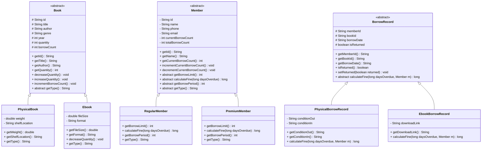
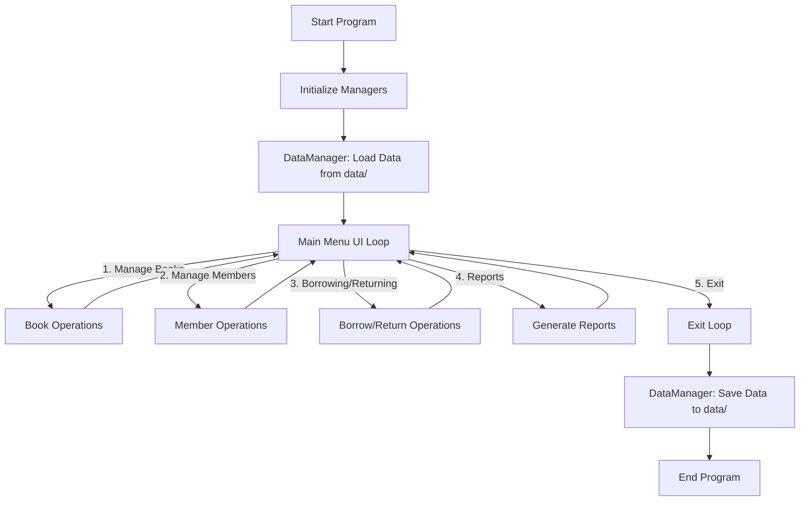

# Library Management System

This is an Object-Oriented Library Management System written in Java. It provides a comprehensive solution for managing books, library members, and the borrowing/returning process via a command-line interface.

## Architecture

The project is structured into three main layers:

- **Entities (`entity/`)**: Represents the core data models using Object-Oriented Inheritance.
  - `Book`: Abstract base class for books.
    - `PhysicalBook`: Inherits from `Book`, adds weight and shelf location.
    - `Ebook`: Inherits from `Book`, adds file size and format, overrides quantity behavior.
  - `Member`: Abstract base class representing library users.
    - `RegularMember`: Inherits from `Member`, basic borrowing limits and fines.
    - `PremiumMember`: Inherits from `Member`, extended borrowing limits and reduced fines.
  - `BorrowRecord`: Abstract base class tracking borrowing transactions.
    - `PhysicalBorrowRecord`: Inherits from `BorrowRecord`, includes physical condition out/in, calculates normal fines.
    - `EbookBorrowRecord`: Inherits from `BorrowRecord`, includes download link, ignores overdue fines.

### Entity Class Diagram

- **Managers (`manager/`)**: Handles the business logic and operations for the entities.
  - `BookManager`: Manages the inventory of books (CRUD operations, search, popularity reports).
  - `MemberManager`: Manages library members (CRUD operations, search, member borrow counts).
  - `BorrowManager`: Handles the logic for borrowing and returning books, checking limits, and generating overdue reports.
  - `DataManager`: Handles data persistence, saving and loading application state to/from text files in the `data/` directory.

- **Main App (`Main.java`)**: The entry point of the application containing the console-based User Interface (UI), which wires all managers together using Dependency Injection.

## Application Flow

### Flow Diagram

1. **Initialization**: When the app starts, `Main.java` initializes the manager classes (`BookManager`, `MemberManager`, `BorrowManager`) and sets up dependencies.
2. **Data Loading**: `DataManager.loadData()` is called to retrieve existing records from the `data/` folder and populate the managers.
3. **Main Loop**: The system presents a main menu to the user with options to navigate into sub-menus:
   - Manage Books
   - Manage Members
   - Borrowing/Returning
   - Reports
4. **Operation Processing**:
   - The user selects a category and performs operations (e.g., adding a book, updating a member, processing a borrow transaction).
   - Operations are validated in the `Manager` classes (e.g., checking if a member has reached their borrow limit or if a book is out of stock) before modifying the in-memory data structures.
5. **Termination and Data Saving**: When the user chooses to exit the program, `DataManager.saveData()` is invoked. This serializes all changes from the current session and saves them to the text files in the `data/` folder, ensuring data is preserved for the next run.

## Key Features

- **Book Management**: Add, update quantity, remove (with safety checks for active loans), view all, and search.
- **Member Management**: Add (Regular limit: 3 books, Premium limit: 5 books), update contact info, remove, view all, and search.
- **Borrow & Return System**: Records transactions with dates. Tracks current outstanding loans and prevents members from borrowing beyond their limits.
- **Reporting**: Generates reports for currently borrowed books, past borrow history, popular books, member activity stats, and overdue items based on today's date.
